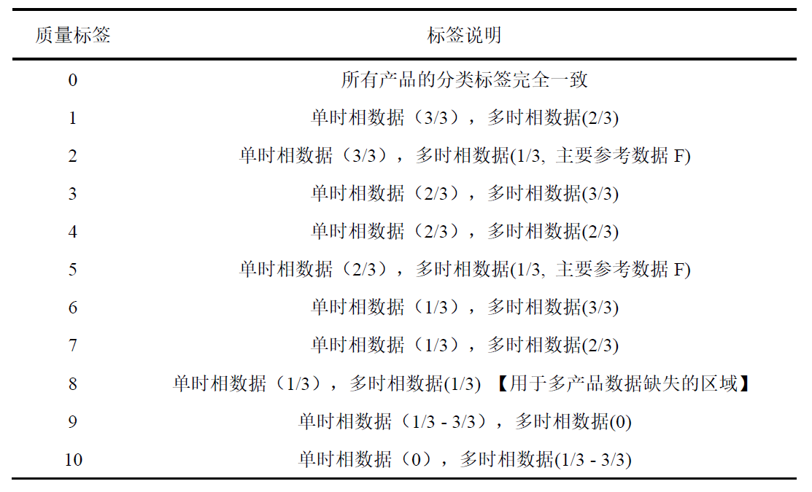

## An ensemble classification product of plant functional types 
Owing to climate changes and human activities, the vegetation cover, species community in the Qinghai-Tibet Plateau have changed dramatically, hence the early vegetation map of Qinghai-Tibet Plateau (produced in 20th century) cannot effectively reflect the real vegetation distribution. In addition, current products mostly belong to the land cover classification system, which is not perfectly suitable for vegetation classification.
  
Therefore, we design a more suitable plan for vegetation classification, and produced an ensenmble product from current land cover products and a self-designed vegetation map. We also operted a comparsion with these land cover products by using the validation samples from multiple sources.
  
It showed that the overall accuracy (78.09%, kappa coefficient is 0.75) of the real vegetation map of Qinghai-Tibet Plateau increased by 18.84%~37.17%, especially for grassland and shrub.
### Classification results
* QHTP_PFT_Classification.zip
### Article
* Title: A Real Vegetation Map of Qinghai-Tibet Plateau Produced with the Integrated Classification Method based on Multi-source Data Products
* Journal: Journal of Beijing Normal University (Natural Science) 
* Author: Hui Zhang, Cengliang Zhao, Wenquan Zhu*
* DOI: [10.12202/j.0476-0301.2021171](http://www.bnujournal.com/en/article/doi/10.12202/j.0476-0301.2021171) 

### Ensemble members

### Comparison results

### Classification result

### Quality labels

