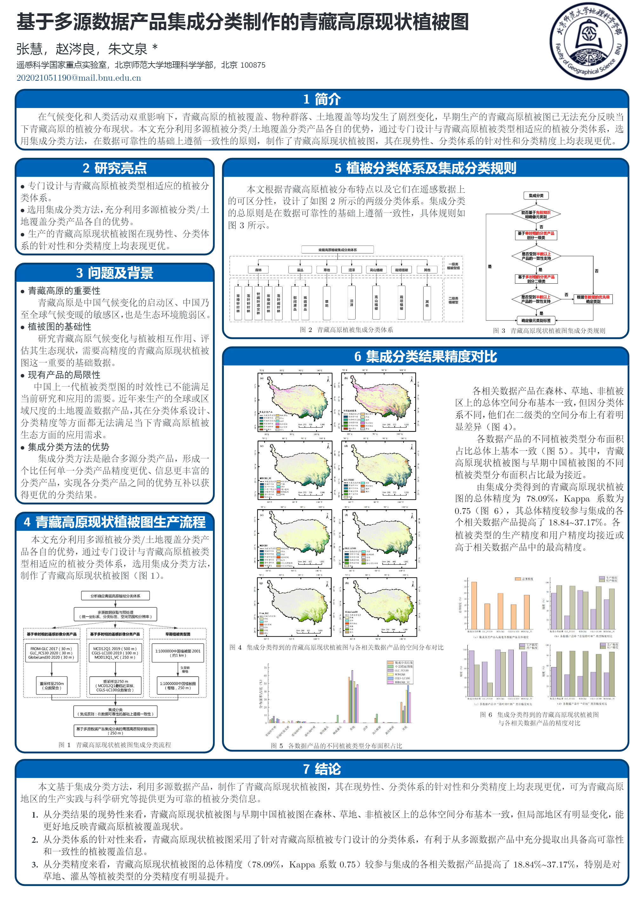

## Introduction
* This project contains the dataset and part of the code of an article on seasonal LUEmax simulation
 

### Article
* Title: A Real Vegetation Map of Qinghai-Tibet Plateau Produced with the Integrated Classification Method based on Multi-source Data Products
* Journal: Journal of Beijing Normal University (Natural Science) 
* Author: Hui Zhang, Cengliang Zhao, Wenquan Zhu*
* DOI: [10.12202/j.0476-0301.2021171](http://www.bnujournal.com/en/article/doi/10.12202/j.0476-0301.2021171) 

### Poster

